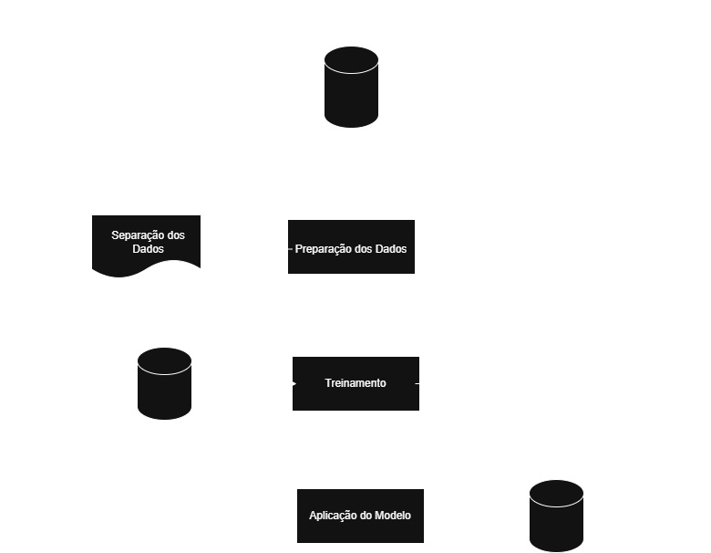
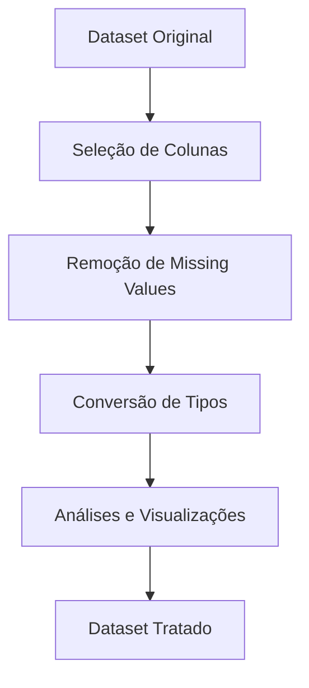
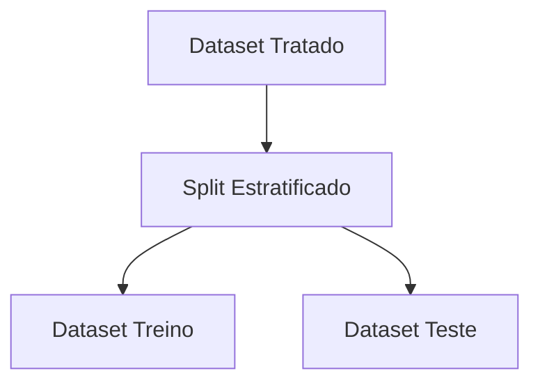
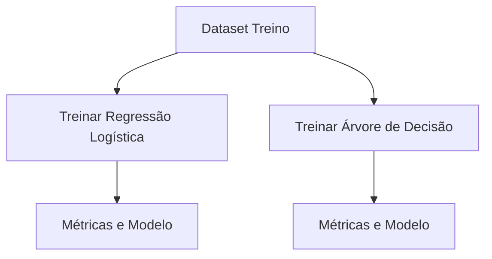
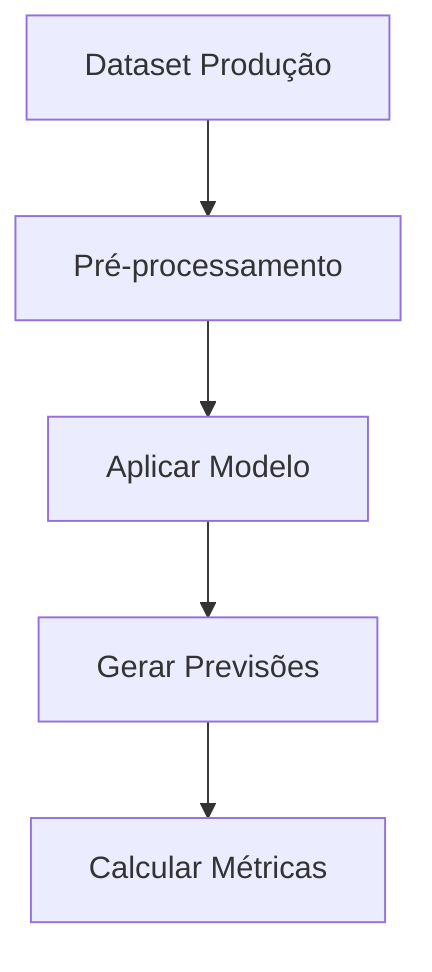
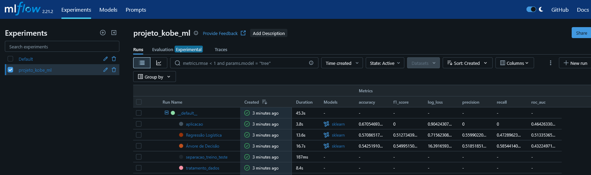
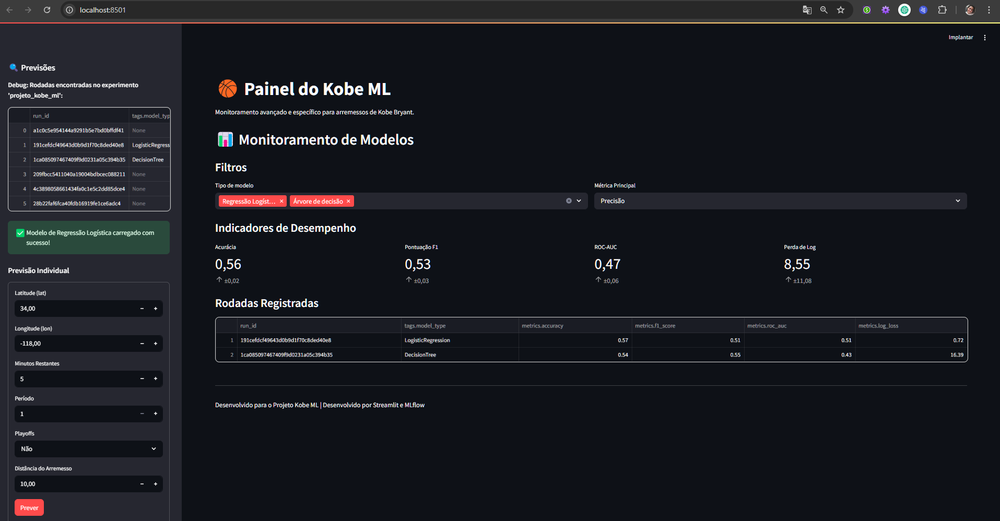

# Projeto Kobe Bryant Shot Prediction

Projeto de Machine Learning para prever a probabilidade de acerto de arremessos do jogador de basquete Kobe Bryant, utilizando Kedro, MLflow e PyCaret.

## Visão Geral

Este projeto implementa um pipeline completo de machine learning para:
1. Processar e analisar dados de arremessos do Kobe Bryant
2. Treinar modelos de classificação (Regressão Logística e Árvore de Decisão)
3. Aplicar o modelo em dados de produção
4. Monitorar o desempenho do modelo

 

 

## Configuração do Ambiente

- **Python**: 3.11.9
- **Kedro**: 0.19.12
- **PyCaret**: 3.3.2
- **MLflow**: 2.21.2

## Estrutura do Projeto

projeto-kobe-ml/  
├── conf/ # Configurações do projeto  
├── data/ # Dados em diferentes estágios  
├── docs/ # Documentação  
├── logs/ # Logs de execução  
├── notebooks/ # Jupyter notebooks  
├── src/ # Código fonte  
│ ├── projeto_kobe_ml/  
│ │ ├── hooks.py # Hooks personalizados  
│ │ ├── pipelines/ # Pipelines do projeto  
│ │ │ ├── aplicacao/  
│ │ │ ├── separacao_treino_teste/  
│ │ │ ├── tratamento_dados/  
│ │ │ └── treinamento/  
│ │ └── init.py  
└── pyproject.toml # Configuração do projeto Kedro  

## Pipelines

### 1. Pipeline de Tratamento de Dados

**Entrada**: `dataset_kobe_dev.parquet` (dados brutos)

**Saída**: `dados_tratados.parquet` (dados processados)

**Processos**:
- Seleção de colunas relevantes
- Remoção de valores faltantes
- Conversão de tipos de dados
- Geração de análises e visualizações

**Diagrama**:

### 2. Pipeline de Separação Treino-Teste

**Entrada**: `dados_tratados.parquet` (dados processados)

**Saída**: 

- `dados_treino.parquet` (80% dos dados)
- `dados_teste.parquet` (20% dos dados)

**Processos**:
- Divisão estratificada dos dados
- Balanceamento das classes
- Log de métricas de distribuição

**Diagrama**:

### 3. Pipeline de Treinamento

**Entrada**: 
- `dados_treino.parquet`
- `dados_teste.parquet`

**Saída**:

- `logistic_regression_model.pkl` (modelo de regressão logística)
- `decision_tree_model.pkl` (modelo de árvore de decisão)

**Processos**:
- Configuração do ambiente PyCaret
- Treinamento dos modelos
- Avaliação com métricas (Log Loss, F1 Score, AUC-ROC)
- Registro no MLflow

**Diagrama**:

### 4. Pipeline de Aplicação

**Entrada**: 
- `dataset_kobe_prod.parquet` (dados de produção)
- `logistic_regression_model.pkl` (modelo treinado)

**Saída**:

- Previsões registradas no MLflow
- Métricas de desempenho em produção

**Processos**:
- Pré-processamento dos dados de produção
- Aplicação do modelo
- Cálculo de métricas
- Comparação com dados de desenvolvimento

**Diagrama**:

 
 
 
 
 

# Respostas e Melhorias para a Pós-Graduação

1. **O aluno categorizou corretamente os dados?**  
   Sim, o aluno categorizou corretamente os dados, selecionando as colunas relevantes e convertendo os tipos de dados apropriadamente.

 

2. **O aluno integrou a leitura dos dados corretamente à sua solução?**  
   Sim, a leitura dos dados está integrada via Kedro Data Catalog, com datasets definidos no `catalog.yml`.

 

3. **O aluno aplicou o modelo em produção?**  
   Sim, o pipeline de aplicação implementa a aplicação do modelo em dados de produção, mas poderia ser melhorado com uma API REST.

 

4. **O aluno indicou se o modelo é aderente a nova base de dados?**  
   Sim, o código compara métricas entre dev e produção.

 

5. **O aluno criou um repositório git com a estrutura Kedro?**  
   Sim, a estrutura do projeto segue o padrão Kedro.

 

6. **O aluno criou diagramas das etapas?**  
   Sim, conforme mostrado no README.

 

7. **O aluno treinou modelos com PyCaret e MLflow?**  
   Sim, treinou Regressão Logística e Árvore de Decisão, registrando no MLflow.

 

8. **O aluno calculou métricas e registrou no MLflow?**  
   Sim, calculou Log Loss, F1 Score, AUC-ROC e outras métricas para ambos os modelos.

 

9. **O aluno descreveu os artefatos?**  
   Sim, mas poderia ser mais detalhado no README.

 

10. **O aluno cobriu todos os artefatos do diagrama?**  
    Sim, todas as etapas do diagrama foram implementadas.

 

11. **O aluno usou MLflow para preparação de dados?**  
    Sim, registrou métricas e parâmetros da etapa de preparação.

 

12. **O aluno removeu dados faltantes?**  
    Sim, removeu linhas com valores faltantes na coluna target.

 

13. **O aluno selecionou colunas relevantes?**  
    Sim, selecionou 7 colunas relevantes para o modelo.

 

14. **O aluno indicou dimensões da base processada?**  
    Sim, registrou no MLflow o número de linhas e colunas após processamento.

 

15. **O aluno armazenou arquivos em pastas indicadas?**  
    Sim, seguiu a estrutura de pastas do Kedro (raw, intermediate, primary).

 

16. **O aluno separou em treino e teste?**  
    Sim, com split estratificado de 80/20.

 

17. **O aluno criou pipeline de treinamento no MLflow?**  
    Sim, com runs separados para cada modelo.

    

 

18. **O aluno identificou diferenças entre dev e produção?**  
    Sim,o código compara métricas.

     

    *O modelo não é aderente a nova base, isso por que a nova base possui apenas
    dados de arremessos de 3 pontos (mais distantes)*

 

19. **O aluno descreveu monitoramento?**  
    Sim. Implementei tracking no MLflow.

     

    O monitoramento da saúde do modelo pode ser realizado de forma eficaz em
    ambos os cenários, com e sem a disponibilidade da variável resposta. Em cada
    caso, abordagens específicas são aplicadas para garantir a avaliação contínua da
    performance do modelo.

 

20. **O aluno implementou dashboard Streamlit?**  
    Sim, segue a imagem.

    

 

21. **O aluno descreveu estratégias de retreinamento?**

    O retreinamento de modelos em operação pode ser feito de forma reativa ou
    preditiva.

     

    A estratégia reativa ocorre após identificar uma queda no desempenho, com base
    em métricas como acurácia ou mudanças nos dados (data drift). Apesar de
    simples, ela pode levar a períodos de baixa performance antes que o problema seja
    corrigido.
     

    Já a abordagem preditiva antecipa a necessidade de retreinamento ao monitorar
    sinais como alterações nas distribuições dos dados ou incertezas nas predições.

     

    Assim, o modelo é atualizado antes que haja impacto significativo, evitando falhas
    futuras. Ambas podem ser usadas de forma complementar, garantindo maior
    robustez e eficiência no ciclo de vida do modelo

 

---
